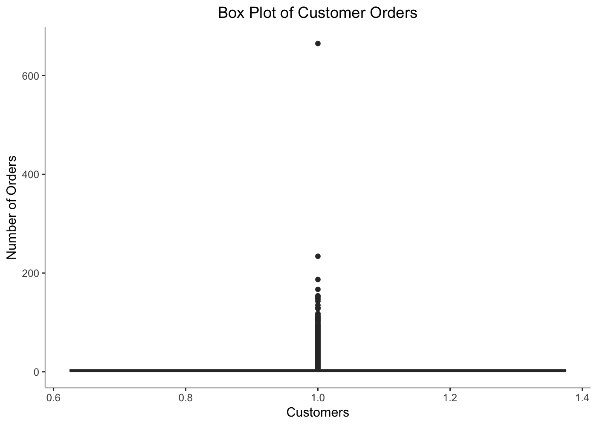

Iconic Challenge - Stage 2
================

Step 1: Download the password protected compressed json file
------------------------------------------------------------

Download from the git repository  

``` r
filep <- "https://github.com/theiconic/datascientist/raw/master/test_data.zip"
filename <- "../Data/test_data.zip"
download.file(url=filep, destfile=filename)
```

Step 2: Hashed Password
-----------------------

The password can be managed in a better way. Example: store it in a config file or credential store  

``` r
filepwd <- digest(object = 'welcometotheiconic', algo = 'sha256', serialize = FALSE)
```

Step 3: Extact zip file.
------------------------

Note: This requires an installation of 7zip (Third Party Software)  

``` r
sys_command <- paste0("7z ", "x ", filename, " -p", filepwd, " -o../Data -aoa")
system(sys_command, intern = F)
```

Step 4: Load JSON file.
-----------------------

Load the extracted JSON file  

``` r
jsonfile <- "../Data/data.json"
fjson <- read_json(jsonfile)
```

Step 5: Convert JSON to R data.table
------------------------------------

``` r
customerDT <- rbindlist(fjson, fill = T)

#Summarize data table
summary(customerDT)
```

    ##  customer_id        days_since_first_order days_since_last_order
    ##  Length:46279       Min.   :   1           Min.   :   24        
    ##  Class :character   1st Qu.: 910           1st Qu.: 6816        
    ##  Mode  :character   Median :1713           Median :25560        
    ##                     Mean   :1374           Mean   :24593        
    ##                     3rd Qu.:1786           3rd Qu.:41640        
    ##                     Max.   :2164           Max.   :51840        
    ##                                                                 
    ##  is_newsletter_subscriber     orders            items        
    ##  Length:46279             Min.   :  1.000   Min.   :  1.000  
    ##  Class :character         1st Qu.:  1.000   1st Qu.:  1.000  
    ##  Mode  :character         Median :  2.000   Median :  3.000  
    ##                           Mean   :  4.108   Mean   :  8.575  
    ##                           3rd Qu.:  4.000   3rd Qu.:  7.000  
    ##                           Max.   :665.000   Max.   :701.000  
    ##                                                              
    ##     cancels            returns        different_addresses
    ##  Min.   :  0.0000   Min.   :  0.000   Min.   :0.0000     
    ##  1st Qu.:  0.0000   1st Qu.:  0.000   1st Qu.:0.0000     
    ##  Median :  0.0000   Median :  0.000   Median :0.0000     
    ##  Mean   :  0.0531   Mean   :  1.622   Mean   :0.1166     
    ##  3rd Qu.:  0.0000   3rd Qu.:  1.000   3rd Qu.:0.0000     
    ##  Max.   :460.0000   Max.   :343.000   Max.   :1.0000     
    ##                                                          
    ##  shipping_addresses    devices         vouchers        cc_payments    
    ##  Min.   : 1.000     Min.   :1.000   Min.   : 0.0000   Min.   :0.0000  
    ##  1st Qu.: 1.000     1st Qu.:1.000   1st Qu.: 0.0000   1st Qu.:0.0000  
    ##  Median : 1.000     Median :1.000   Median : 0.0000   Median :1.0000  
    ##  Mean   : 1.501     Mean   :1.277   Mean   : 0.9403   Mean   :0.6424  
    ##  3rd Qu.: 2.000     3rd Qu.:1.000   3rd Qu.: 1.0000   3rd Qu.:1.0000  
    ##  Max.   :15.000     Max.   :3.000   Max.   :57.0000   Max.   :1.0000  
    ##                                                                       
    ##  paypal_payments  afterpay_payments apple_payments       female_items    
    ##  Min.   :0.0000   Min.   :0.00000   Min.   :0.0000000   Min.   :  0.000  
    ##  1st Qu.:0.0000   1st Qu.:0.00000   1st Qu.:0.0000000   1st Qu.:  0.000  
    ##  Median :0.0000   Median :0.00000   Median :0.0000000   Median :  2.000  
    ##  Mean   :0.4909   Mean   :0.05344   Mean   :0.0005618   Mean   :  6.466  
    ##  3rd Qu.:1.0000   3rd Qu.:0.00000   3rd Qu.:0.0000000   3rd Qu.:  5.000  
    ##  Max.   :1.0000   Max.   :1.00000   Max.   :1.0000000   Max.   :537.000  
    ##                                                                          
    ##    male_items       unisex_items       wapp_items        wftw_items     
    ##  Min.   :  0.000   Min.   : 0.0000   Min.   :  0.000   Min.   :  0.000  
    ##  1st Qu.:  0.000   1st Qu.: 0.0000   1st Qu.:  0.000   1st Qu.:  0.000  
    ##  Median :  0.000   Median : 0.0000   Median :  0.000   Median :  0.000  
    ##  Mean   :  1.719   Mean   : 0.3901   Mean   :  3.795   Mean   :  1.633  
    ##  3rd Qu.:  1.000   3rd Qu.: 0.0000   3rd Qu.:  2.000   3rd Qu.:  2.000  
    ##  Max.   :273.000   Max.   :83.0000   Max.   :409.000   Max.   :261.000  
    ##                                                                         
    ##    mapp_items         wacc_items         macc_items      
    ##  Min.   :  0.0000   Min.   :  0.0000   Min.   :  0.0000  
    ##  1st Qu.:  0.0000   1st Qu.:  0.0000   1st Qu.:  0.0000  
    ##  Median :  0.0000   Median :  0.0000   Median :  0.0000  
    ##  Mean   :  0.9271   Mean   :  0.5736   Mean   :  0.5736  
    ##  3rd Qu.:  0.0000   3rd Qu.:  0.0000   3rd Qu.:  0.0000  
    ##  Max.   :151.0000   Max.   :353.0000   Max.   :353.0000  
    ##                                                          
    ##    mftw_items        wspt_items        mspt_items       curvy_items       
    ##  Min.   : 0.0000   Min.   : 0.0000   Min.   : 0.0000   Min.   :  0.00000  
    ##  1st Qu.: 0.0000   1st Qu.: 0.0000   1st Qu.: 0.0000   1st Qu.:  0.00000  
    ##  Median : 0.0000   Median : 0.0000   Median : 0.0000   Median :  0.00000  
    ##  Mean   : 0.4201   Mean   : 0.3785   Mean   : 0.1159   Mean   :  0.04142  
    ##  3rd Qu.: 0.0000   3rd Qu.: 0.0000   3rd Qu.: 0.0000   3rd Qu.:  0.00000  
    ##  Max.   :78.0000   Max.   :56.0000   Max.   :38.0000   Max.   :116.00000  
    ##                                                                           
    ##    sacc_items        msite_orders      desktop_orders   
    ##  Min.   : 0.00000   Min.   :  0.0000   Min.   :  0.000  
    ##  1st Qu.: 0.00000   1st Qu.:  0.0000   1st Qu.:  1.000  
    ##  Median : 0.00000   Median :  0.0000   Median :  1.000  
    ##  Mean   : 0.08764   Mean   :  0.9781   Mean   :  2.624  
    ##  3rd Qu.: 0.00000   3rd Qu.:  1.0000   3rd Qu.:  3.000  
    ##  Max.   :29.00000   Max.   :172.0000   Max.   :665.000  
    ##                                                         
    ##  android_orders       ios_orders      other_device_orders
    ##  Min.   : 0.00000   Min.   : 0.0000   Min.   :0.00e+00   
    ##  1st Qu.: 0.00000   1st Qu.: 0.0000   1st Qu.:0.00e+00   
    ##  Median : 0.00000   Median : 0.0000   Median :0.00e+00   
    ##  Mean   : 0.04294   Mean   : 0.4629   Mean   :4.32e-05   
    ##  3rd Qu.: 0.00000   3rd Qu.: 0.0000   3rd Qu.:0.00e+00   
    ##  Max.   :33.00000   Max.   :84.0000   Max.   :2.00e+00   
    ##                                                          
    ##   work_orders       home_orders      parcelpoint_orders
    ##  Min.   : 0.0000   Min.   :  0.000   Min.   : 0.00000  
    ##  1st Qu.: 0.0000   1st Qu.:  0.000   1st Qu.: 0.00000  
    ##  Median : 0.0000   Median :  0.000   Median : 0.00000  
    ##  Mean   : 0.2398   Mean   :  1.532   Mean   : 0.02528  
    ##  3rd Qu.: 0.0000   3rd Qu.:  1.000   3rd Qu.: 0.00000  
    ##  Max.   :84.0000   Max.   :175.000   Max.   :32.00000  
    ##                                                        
    ##  other_collection_orders redpen_discount_used coupon_discount_applied
    ##  Min.   :  0.000         Min.   :     0.00    Min.   :    0.0        
    ##  1st Qu.:  1.000         1st Qu.:     0.00    1st Qu.:    0.0        
    ##  Median :  1.000         Median :    54.48    Median :    0.0        
    ##  Mean   :  2.311         Mean   :   435.22    Mean   :  174.4        
    ##  3rd Qu.:  2.000         3rd Qu.:   253.65    3rd Qu.:   61.8        
    ##  Max.   :665.000         Max.   :102653.77    Max.   :33332.3        
    ##                                               NA's   :10205          
    ##  average_discount_onoffer average_discount_used    revenue        
    ##  Min.   :0.0000           Min.   :    0.00      Min.   :     0.0  
    ##  1st Qu.:0.0000           1st Qu.:   83.88      1st Qu.:    76.3  
    ##  Median :0.1500           Median : 2122.65      Median :   212.7  
    ##  Mean   :0.1903           Mean   : 2357.38      Mean   :  1303.7  
    ##  3rd Qu.:0.3143           3rd Qu.: 3829.88      3rd Qu.:   790.5  
    ##  Max.   :1.0000           Max.   :10000.00      Max.   :354700.2  
    ## 

Step 6: Finding anomalies in the data
-------------------------------------

As mentioned in the instructions, the data looks correct from the summary. There are 10,205 nulls in coupon\_discount\_applied. Other columns do not have any nulls  
At this stage, we just assume the nulls to be 0 but these can be imputed with the help of other information on how the discounts are used by customer.  
For that, we would need more business knowledge around the definition and usage of coupon\_discount\_applied  

``` r
# Impute nulls with 0
customerDT[is.na(coupon_discount_applied) == T, coupon_discount_applied:=0]
```

Convert is\_newsletter\_subscriber to numeric. This will help in further analysis where some algorithms expect data to be numeric  

``` r
customerDT[is_newsletter_subscriber == 'N',is_newsletter_subscriber := 0]
customerDT[is_newsletter_subscriber == 'Y',is_newsletter_subscriber := 1]
customerDT[, is_newsletter_subscriber := as.numeric(is_newsletter_subscriber)]
```

Find duplicates in the data  

``` r
#Unique customers
customerDT[,uniqueN(customer_id)]
```

    ## [1] 46030

There are 46,279 Customers in the dataset out of which 46,030 are unique.  
Let us look at some of the duplicate customer data  

``` r
customerDT[customer_id %in%head(customerDT[duplicated(customer_id) == T,customer_id],5)][order(customer_id)]
```

    ##                          customer_id days_since_first_order
    ##  1: 145a915a54c17dd0082bab97fd9cf9f7                   1972
    ##  2: 145a915a54c17dd0082bab97fd9cf9f7                   1972
    ##  3: 2da5f92651ed139984cab6fb3d22a380                   1817
    ##  4: 2da5f92651ed139984cab6fb3d22a380                   1817
    ##  5: 4111510781756c956c40fbf105757b66                   1736
    ##  6: 4111510781756c956c40fbf105757b66                   1736
    ##  7: ca751f4d8837c3c123089f88fbac5a1d                   1797
    ##  8: ca751f4d8837c3c123089f88fbac5a1d                   1797
    ##  9: ed4eecefbd5d7babf8455eb226069c5a                   1741
    ## 10: ed4eecefbd5d7babf8455eb226069c5a                   1741
    ##     days_since_last_order is_newsletter_subscriber orders items cancels
    ##  1:                 47328                        0      1     2       0
    ##  2:                 47328                        0      1     2       0
    ##  3:                 33288                        0      4    16       0
    ##  4:                 33288                        0      4    16       0
    ##  5:                 41664                        1      1     1       0
    ##  6:                 41664                        1      1     1       0
    ##  7:                 43128                        1      1     1       0
    ##  8:                 43128                        1      1     1       0
    ##  9:                 41784                        1      1     1       0
    ## 10:                 41784                        1      1     1       0
    ##     returns different_addresses shipping_addresses devices vouchers
    ##  1:       0                   0                  1       1        0
    ##  2:       0                   0                  1       1        0
    ##  3:       4                   0                  3       1        0
    ##  4:       4                   0                  3       1        0
    ##  5:       0                   0                  1       1        0
    ##  6:       0                   0                  1       1        0
    ##  7:       0                   0                  1       1        0
    ##  8:       0                   0                  1       1        0
    ##  9:       0                   0                  1       1        0
    ## 10:       0                   0                  1       1        0
    ##     cc_payments paypal_payments afterpay_payments apple_payments
    ##  1:           1               0                 0              0
    ##  2:           1               0                 0              0
    ##  3:           1               1                 0              0
    ##  4:           1               1                 0              0
    ##  5:           0               1                 0              0
    ##  6:           0               1                 0              0
    ##  7:           1               0                 0              0
    ##  8:           1               0                 0              0
    ##  9:           1               0                 0              0
    ## 10:           1               0                 0              0
    ##     female_items male_items unisex_items wapp_items wftw_items mapp_items
    ##  1:            1          0            1          0          1          0
    ##  2:            1          0            1          0          1          0
    ##  3:           16          0            0          1         14          0
    ##  4:           16          0            0          1         14          0
    ##  5:            0          0            1          0          0          0
    ##  6:            0          0            1          0          0          0
    ##  7:            0          1            0          0          0          0
    ##  8:            0          1            0          0          0          0
    ##  9:            0          1            0          0          0          0
    ## 10:            0          1            0          0          0          0
    ##     wacc_items macc_items mftw_items wspt_items mspt_items curvy_items
    ##  1:          1          1          0          0          0           0
    ##  2:          1          1          0          0          0           0
    ##  3:          1          1          0          0          0           0
    ##  4:          1          1          0          0          0           0
    ##  5:          0          0          0          0          0           0
    ##  6:          0          0          0          0          0           0
    ##  7:          0          0          0          0          0           0
    ##  8:          0          0          0          0          0           0
    ##  9:          0          0          1          0          0           0
    ## 10:          0          0          1          0          0           0
    ##     sacc_items msite_orders desktop_orders android_orders ios_orders
    ##  1:          0            0              1              0          0
    ##  2:          0            0              1              0          0
    ##  3:          0            0              4              0          0
    ##  4:          0            0              4              0          0
    ##  5:          0            1              0              0          0
    ##  6:          0            1              0              0          0
    ##  7:          0            0              1              0          0
    ##  8:          0            0              1              0          0
    ##  9:          0            1              0              0          0
    ## 10:          0            1              0              0          0
    ##     other_device_orders work_orders home_orders parcelpoint_orders
    ##  1:                   0           0           0                  0
    ##  2:                   0           0           0                  0
    ##  3:                   0           0           0                  0
    ##  4:                   0           0           0                  0
    ##  5:                   0           0           0                  0
    ##  6:                   0           0           0                  0
    ##  7:                   0           0           0                  0
    ##  8:                   0           0           0                  0
    ##  9:                   0           0           0                  0
    ## 10:                   0           0           0                  0
    ##     other_collection_orders redpen_discount_used coupon_discount_applied
    ##  1:                       1                 9.08                       0
    ##  2:                       1                 9.08                       0
    ##  3:                       4              1416.73                       0
    ##  4:                       4              1416.73                       0
    ##  5:                       1                17.31                       0
    ##  6:                       1                17.31                       0
    ##  7:                       1                 5.44                       0
    ##  8:                       1                 5.44                       0
    ##  9:                       1                43.36                       0
    ## 10:                       1                43.36                       0
    ##     average_discount_onoffer average_discount_used revenue
    ##  1:                   0.1001              1000.882  163.46
    ##  2:                   0.1001              1000.882  163.46
    ##  3:                   0.3068              3068.178 2273.46
    ##  4:                   0.3068              3068.178 2273.46
    ##  5:                   0.2140              2139.679   63.59
    ##  6:                   0.2140              2139.679   63.59
    ##  7:                   0.1999              1998.531   21.78
    ##  8:                   0.1999              1998.531   21.78
    ##  9:                   0.3000              2999.862  101.18
    ## 10:                   0.3000              2999.862  101.18

Looking at the customer details, it is confirmed that these customers have entire details duplicated.  
Let's remove the records which are completely duplicated as they do not add to the information already available.  

``` r
customerDT <- unique(customerDT)
#Check again for duplicate customer ids
customerDT[duplicated(customer_id) == T,customer_id]
```

    ## character(0)

So, all the duplicate customer ids had their entire details duplicated.  
It seems these customers were intentionally duplicated and hence they have been removed from analysis.  

``` r
#Check days since last order and first order
customerDT[days_since_last_order > days_since_first_order, .N*100/nrow(customerDT)]
```

    ## [1] 94.2103

More than 94% of the records have, days since last order greater than days since first order.  
It appears that these are the two columns where although the data looks correct but isn't really correct.  
These two columns appear to be swapped  

``` r
#Fix issue with days since last order and first order
customerDT[days_since_last_order > days_since_first_order, c('days_since_last_order', 'days_since_first_order'):=.(days_since_first_order,days_since_last_order)]
```

The range of days is in years, so this data about the customer seems to be shifted by some deviation.  
Also, comparing the average\_discount\_used with the revenue figures, it seems either of them or both of them have been shifted by some deviation.  

``` r
# More cancellations than orders per customer
customerDT[cancels > orders, .N*100/nrow(customerDT)]
```

    ## [1] 0.01303498

``` r
# More returns than orders per customer
customerDT[returns > orders, .N*100/nrow(customerDT)]
```

    ## [1] 4.084293

``` r
# No revenue generating customers
customerDT[(revenue + redpen_discount_used + coupon_discount_applied + average_discount_used) <= 0 & (orders-cancels-returns > 0), .N*100/nrow(customerDT)]
```

    ## [1] 1.370845

There are very few instances where a customer has cancelled more than they ordered(.01%)  
There are around 4% customers who have returned more orders than they have placed  
And, there are around 1% customers who haven't generated a revenue after considering all cancellations, returns and discounts  
We are not sure why we have these anomalies.  
It could be intentional data manipulation or caused because of applying deviations to the original data.  
Not treating these anomalies at the moment.  

``` r
# Outlier Analysis on customer orders
qplot(y=customerDT$orders, x= 1, geom = "boxplot")+
  labs(x = "Customers", y = "Number of Orders") +
  labs(title="Box Plot of Customer Orders", size = 15) +
  theme(panel.background = element_blank(), axis.line = element_line(colour = "grey"),  plot.title = element_text(hjust = 0.5))
```



``` r
# Extracting the orders in the upper whisker of the box plot
customerDT[orders>max(boxplot.stats(customerDT$orders)$stats), list(orders)][order(-orders)]
```

    ##       orders
    ##    1:    665
    ##    2:    234
    ##    3:    187
    ##    4:    167
    ##    5:    154
    ##   ---       
    ## 5058:      9
    ## 5059:      9
    ## 5060:      9
    ## 5061:      9
    ## 5062:      9

The same analysis can be done on all the details of the cutomers.  
We may find some outliers but at this stage, without more information about the exact cause of the extreme outlier values, we are leaving them as-is in the dataset.  

Step 7: Save Cleaned Dataset to a file
--------------------------------------

``` r
# Save cleaned dataset to a file
fwrite(customerDT, "../Data/cleanedData.csv")
```

[Stage 3](Stage3.md)
