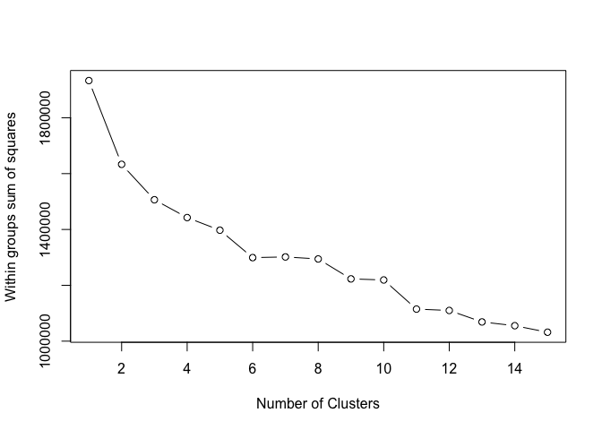

Iconic Challenge - Stage 3
================

Step 1: Load the cleaned dataset
--------------------------------

Load from the local directory

``` r
customerDT <- fread("../Data/cleanedData.csv")
```

Step 2: Clustering Analysis
---------------------------

Since we do not have labelled data, we would perform an unsupervised learning  
We are aware that customers shop for either female or male or unisex items, so would be looking for at least 3 clusters that splits customers based on their gender preference.  
But let's try to find optimal number of clusters first  

``` r
# Initialize total within sum of squares error: wss
wss <- 0

# For 1 to 15 cluster centers
for (i in 1:15) {
  km.out <- kmeans(scale(customerDT[,2:43]), centers = i,nstart = 2, iter.max = 20)
  # Save total within sum of squares to wss variable
  wss[i] <- km.out$tot.withinss
}

# Plot total within sum of squares vs. number of clusters
plot(1:15, wss, type = "b", 
     xlab = "Number of Clusters", 
     ylab = "Within groups sum of squares")
```



Looking at the plot, there is no clear bend in the plot that suggests optimal clusters  
Let's attempt to run clustering using 3 clusters and look at the accuracy  

``` r
# Clustering using all the dimensions and 3 clusters
clusters <- kmeans(scale(customerDT[,2:43]), 3, nstart = 2)
clusters
```

    ## K-means clustering with 3 clusters of sizes 5078, 414, 40538
    ## 
    ## Cluster means:
    ##   days_since_first_order days_since_last_order is_newsletter_subscriber
    ## 1             -1.0635186           -0.18531594                0.7778534
    ## 2             -1.2706579           -0.74539252                0.9809439
    ## 3              0.1461986            0.03082606               -0.1074560
    ##       orders      items     cancels    returns different_addresses
    ## 1  1.3550636  1.2637595  0.03642201  0.7427906           0.7552094
    ## 2  6.3525201  7.4414828  0.78163579  6.5993529           1.3919093
    ## 3 -0.2346183 -0.2343022 -0.01254498 -0.1604426          -0.1088165
    ##   shipping_addresses    devices  vouchers cc_payments paypal_payments
    ## 1          1.5443570  1.4650709  1.281464  0.46074061      0.33202777
    ## 2          2.9046264  2.0204785  5.443182  0.63929294      0.33331611
    ## 3         -0.2231181 -0.2041568 -0.216112 -0.06424363     -0.04499556
    ##   afterpay_payments apple_payments female_items male_items unisex_items
    ## 1        0.52973611     0.08397331    1.0916200  0.8902363    0.7249160
    ## 2        0.78089430     0.28120793    7.4890391  2.1203387    2.7656364
    ## 3       -0.07433248    -0.01339081   -0.2132248 -0.1331699   -0.1190512
    ##   wapp_items wftw_items mapp_items wacc_items macc_items mftw_items
    ## 1  0.9801002  1.0174976  0.8207154  0.5939659  0.5939659  0.6713865
    ## 2  7.3810826  5.1657193  1.7822641  4.0864154  4.0864154  1.6868923
    ## 3 -0.1981528 -0.1802127 -0.1210087 -0.1161363 -0.1161363 -0.1013290
    ##   wspt_items mspt_items curvy_items  sacc_items msite_orders
    ## 1  0.7644900  0.4450427  0.08835035  0.45532812    0.9577147
    ## 2  4.4386587  1.4318669  0.68782312  2.23643192    3.3799971
    ## 3 -0.1410944 -0.0703715 -0.01809171 -0.07987663   -0.1544870
    ##   desktop_orders android_orders ios_orders other_device_orders work_orders
    ## 1      1.0316767     0.29942261  0.7277699       -0.0046610044   0.5989642
    ## 2      4.9007905     1.39895472  4.5318187       -0.0046610044   2.2243251
    ## 3     -0.1792832    -0.05179425 -0.1374461        0.0006314627  -0.0977456
    ##   home_orders parcelpoint_orders other_collection_orders
    ## 1   1.1648265         0.25111109               0.9196205
    ## 2   5.6860323         0.71259679               4.3345587
    ## 3  -0.2039816        -0.03873297              -0.1594637
    ##   redpen_discount_used coupon_discount_applied average_discount_onoffer
    ## 1            0.7082726               0.6568315             0.0032683304
    ## 2            5.7080489               5.6132634            -0.0786298265
    ## 3           -0.1470162              -0.1396044             0.0003936101
    ##   average_discount_used    revenue
    ## 1            0.18071311  0.6910598
    ## 2            0.14319762  6.2171935
    ## 3           -0.02409949 -0.1500597
    ## 
    ## Clustering vector:
    ##    [1] 1 1 2 3 3 3 3 3 3 3 2 1 1 3 1 1 3 3 3 1 3 3 3 3 1 2 3 3 3 3 3 3 3 3
    ##   [35] 3 3 3 3 3 1 3 3 3 3 3 3 3 3 3 3 1 3 3 3 3 3 1 3 3 3 3 3 3 1 3 3 3 3
    ##   [69] 3 3 3 3 3 3 1 3 3 1 3 3 3 3 3 3 1 3 1 1 3 3 3 3 3 3 3 3 3 2 3 3 3 3
    ##  [103] 1 3 3 3 3 3 3 3 3 3 3 3 3 1 1 1 2 3 1 3 1 3 2 3 3 3 2 3 3 3 1 1 3 3
    ##  [137] 3 3 3 3 3 3 3 3 3 3 3 3 3 3 3 3 1 3 3 3 3 3 1 3 3 3 3 3 1 3 3 3 3 3
    ##  [171] 3 3 3 3 3 3 3 3 3 3 3 3 3 1 3 1 3 3 3 3 3 3 1 1 3 3 3 1 3 3 3 3 1 3
    ##  [205] 3 3 3 3 3 3 3 3 3 3 3 1 3 3 1 3 3 3 3 3 3 3 3 3 3 3 3 3 3 3 3 3 1 3
    ##  [239] 3 3 3 1 1 3 3 3 3 1 3 3 3 3 1 3 3 3 1 3 3 3 3 3 3 3 3 1 3 3 3 3 3 3
    ##  [273] 3 3 3 3 3 3 3 1 1 3 3 3 3 3 3 3 3 3 1 1 3 3 3 3 3 3 3 3 3 3 3 3 1 3
    ##  [307] 3 3 3 1 3 3 1 3 3 2 3 3 3 3 3 3 2 3 3 3 3 1 3 3 3 3 3 3 1 1 3 1 3 3
    ##  [341] 3 3 3 3 1 3 3 1 3 3 3 1 3 3 1 2 3 1 1 3 3 3 3 3 3 3 3 3 3 3 3 3 3 3
    ##  [375] 3 3 3 3 1 1 3 1 3 3 3 3 1 3 3 3 1 3 3 1 3 3 3 3 3 3 3 3 3 2 3 3 3 3
    ##  [409] 3 1 3 3 1 1 3 3 3 3 1 3 3 3 3 3 3 3 3 3 3 3 3 1 3 3 3 3 1 3 3 3 3 1
    ##  [443] 3 3 3 3 1 3 3 3 3 3 3 1 1 3 1 3 3 3 3 3 3 3 3 3 3 2 3 3 3 3 3 1 3 3
    ##  [477] 3 3 3 3 1 3 3 3 3 3 3 3 1 3 3 3 3 3 3 3 3 1 3 3 3 2 1 3 3 1 3 1 3 3
    ##  [511] 3 3 3 3 1 3 1 3 3 3 3 2 3 3 3 3 1 3 3 1 3 3 3 3 3 3 3 3 3 3 1 3 3 3
    ##  [545] 3 3 3 3 3 3 3 3 3 1 3 3 3 1 3 3 3 3 3 3 3 3 1 3 3 3 3 3 3 3 1 1 3 3
    ##  [579] 1 3 3 3 3 3 1 3 1 3 3 3 3 3 3 3 3 3 3 3 3 3 3 3 3 3 3 3 3 3 3 1 3 3
    ##  [613] 3 1 3 1 3 3 2 1 3 3 3 3 3 3 3 3 3 3 3 2 3 3 3 3 3 3 3 3 1 1 3 3 3 3
    ##  [647] 3 3 3 1 3 3 3 3 3 3 3 2 3 3 3 1 3 3 3 3 3 3 3 3 3 3 3 3 3 3 3 3 3 3
    ##  [681] 3 3 3 3 3 3 3 3 3 3 3 3 3 3 3 3 3 3 3 2 3 3 3 3 3 1 3 1 3 3 3 3 3 3
    ##  [715] 3 3 3 3 3 1 3 3 3 3 3 3 3 3 3 3 3 1 3 3 3 3 3 3 3 3 3 3 3 3 3 3 3 3
    ##  [749] 3 3 1 3 3 3 2 3 3 1 3 3 3 3 3 3 3 3 3 3 3 3 3 3 3 3 3 3 3 3 3 3 3 3
    ##  [783] 3 3 3 3 3 3 3 3 3 3 3 3 3 3 3 3 3 1 3 3 3 3 1 3 3 3 3 1 3 1 3 3 3 3
    ##  [817] 3 3 3 3 3 3 3 3 1 3 3 3 3 3 3 3 3 3 3 3 3 1 3 3 3 3 1 3 3 3 1 3 3 3
    ##  [851] 3 3 1 3 3 3 1 3 3 3 3 3 1 3 3 3 3 3 3 1 3 3 1 3 3 3 3 3 3 3 3 3 3 3
    ##  [885] 3 3 3 3 3 3 3 3 3 3 3 3 3 3 3 3 3 3 3 1 3 3 3 3 3 3 3 3 3 3 3 3 1 3
    ##  [919] 3 3 3 3 1 3 3 3 1 3 3 3 3 3 3 3 3 3 3 3 3 1 3 3 3 3 3 3 3 3 1 3 3 3
    ##  [953] 3 3 1 1 3 3 3 3 3 3 3 1 1 3 3 3 1 3 3 3 1 3 3 3 1 3 3 3 1 3 1 3 3 3
    ##  [987] 1 3 1 3 3 3 3 3 3 3 3 3 2 3
    ##  [ reached getOption("max.print") -- omitted 45030 entries ]
    ## 
    ## Within cluster sum of squares by cluster:
    ## [1] 487028.4 437837.6 581531.4
    ##  (between_SS / total_SS =  22.1 %)
    ## 
    ## Available components:
    ## 
    ## [1] "cluster"      "centers"      "totss"        "withinss"    
    ## [5] "tot.withinss" "betweenss"    "size"         "iter"        
    ## [9] "ifault"

Between/Within accuracy percentage: (between\_SS / total\_SS) = 22.1 %  
The accuracy is low and the cluster sizes does not correspond to the customer's shopping behaviour in terms of gender specific purchases.  

``` r
# Customers who prefer female merchandise over male/unisex merchandise
customerDT[female_items > male_items + unisex_items, .N/nrow(customerDT)*100]
```

    ## [1] 67.06279

I am expecting one of cluster size to be around 67% of the obervations.  
So, we can't really infer the clusters to be gender using this method of unsupervised learning  

Let's try looking at reducing dimensionality using t-SNE algorithm  

``` r
## Rtsne function may take some minutes to complete...
set.seed(131)  
tsne_model_1 = Rtsne(as.matrix(customerDT[,2:43]), check_duplicates=FALSE, pca=TRUE, perplexity=30, theta=0.5, dims=2)

## getting the two dimension matrix
d_tsne_1 = as.data.frame(tsne_model_1$Y) 

setDT(d_tsne_1)

ggplot(d_tsne_1, aes(x=V1, y=V2)) +  
  geom_point(size=0.25) +
  guides(colour=guide_legend(override.aes=list(size=6))) +
  xlab("") + ylab("") +
  ggtitle("t-SNE") +
  theme_light(base_size=20) +
  theme(axis.text.x=element_blank(),
        axis.text.y=element_blank()) +
  scale_colour_brewer(palette = "Set2")
```


Now let's try clustering again using the reduced dimensions  

``` r
## keeping original data
d_tsne_1_original=d_tsne_1

# Initialize total within sum of squares error: wss
wss <- 0

# For 1 to 15 cluster centers
for (i in 1:15) {
  km.out <- kmeans(scale(d_tsne_1), centers = i,nstart = 2, iter.max = 20)
  # Save total within sum of squares to wss variable
  wss[i] <- km.out$tot.withinss
}

# Plot total within sum of squares vs. number of clusters
plot(1:15, wss, type = "b", 
     xlab = "Number of Clusters", 
     ylab = "Within groups sum of squares")
```


Again, looking at the plot, there is no clear bend in the plot that suggests optimal clusters  
Let's try fitting with 3 clusters  

``` r
## Creating k-means clustering model, and assigning the result to the data used to create the tsne
fit_cluster_kmeans=kmeans(scale(d_tsne_1), 3)  
fit_cluster_kmeans
```

    ## K-means clustering with 3 clusters of sizes 15020, 16138, 14872
    ## 
    ## Cluster means:
    ##           V1         V2
    ## 1 -1.0497036  0.3298154
    ## 2  0.8472196  0.6913158
    ## 3  0.1408095 -1.0832626
    ## 
    ## Clustering vector:
    ##    [1] 3 1 1 1 1 1 1 2 3 1 1 2 1 1 1 2 2 1 1 1 2 2 2 1 1 1 1 1 1 1 1 3 2 1
    ##   [35] 3 2 1 1 1 2 1 1 1 1 2 3 2 1 1 1 3 2 1 3 1 1 2 3 2 1 1 1 1 1 1 1 1 1
    ##   [69] 1 2 2 2 1 1 1 1 2 3 1 1 3 1 1 1 1 3 2 1 2 1 1 1 2 2 1 1 2 1 1 1 2 1
    ##  [103] 1 1 3 1 1 3 1 1 2 3 1 1 2 1 3 1 1 2 3 1 3 1 1 1 1 1 1 1 1 2 3 1 1 1
    ##  [137] 1 1 3 1 1 3 1 1 1 1 1 2 3 2 1 1 3 3 2 1 1 2 3 2 3 1 1 2 1 2 1 2 1 1
    ##  [171] 2 2 2 2 1 2 2 1 3 2 2 1 2 1 3 3 1 1 3 1 1 1 3 3 1 2 2 1 1 1 3 1 1 2
    ##  [205] 1 1 1 1 2 1 1 3 3 3 3 2 1 2 2 2 2 1 1 1 1 1 1 1 1 1 1 2 1 1 1 1 3 1
    ##  [239] 1 1 2 1 2 1 1 3 1 1 1 1 3 1 3 1 2 1 3 1 1 1 1 3 2 2 1 3 1 1 2 2 1 1
    ##  [273] 1 1 1 1 2 1 2 1 1 1 3 3 1 2 3 3 1 1 2 2 1 1 3 1 2 1 1 1 1 1 2 1 3 1
    ##  [307] 1 3 1 1 1 1 3 2 1 1 1 1 1 2 2 2 1 3 1 1 1 3 3 2 1 2 1 2 3 3 1 3 1 1
    ##  [341] 3 1 1 3 3 3 1 1 1 1 1 1 1 3 3 1 1 3 3 1 2 2 1 3 1 1 1 1 1 1 2 2 2 1
    ##  [375] 1 1 1 1 1 1 1 3 2 1 3 1 1 2 3 2 1 2 1 1 2 1 1 2 1 3 2 3 1 1 2 1 2 1
    ##  [409] 1 2 1 2 3 2 2 2 2 1 3 1 2 1 2 1 1 3 1 2 1 1 2 2 1 1 1 2 1 2 1 2 1 3
    ##  [443] 1 1 2 1 3 3 2 1 1 1 1 3 2 1 1 1 1 3 1 1 1 1 1 1 1 1 1 1 2 2 1 3 1 1
    ##  [477] 1 1 1 1 3 1 1 1 3 1 1 1 3 1 1 1 1 1 2 1 2 3 1 1 1 1 2 1 1 1 1 3 1 1
    ##  [511] 3 2 1 3 2 1 3 3 1 1 1 1 2 1 1 2 3 2 2 1 2 3 1 1 1 1 1 1 1 1 1 2 1 3
    ##  [545] 1 1 1 1 1 1 2 3 3 1 1 1 1 3 2 2 1 2 1 2 1 3 1 1 1 1 1 2 3 1 3 3 3 3
    ##  [579] 1 1 1 2 1 2 3 1 3 1 1 1 2 3 1 1 1 1 2 1 1 2 2 1 2 1 1 1 1 1 1 2 2 1
    ##  [613] 1 1 2 3 1 1 1 3 2 2 2 2 1 2 1 1 2 2 1 1 2 1 1 1 1 1 2 1 3 3 1 1 2 1
    ##  [647] 1 1 2 2 2 1 1 1 3 1 1 1 1 2 2 1 3 1 1 2 1 2 1 3 3 2 2 1 1 3 1 1 2 1
    ##  [681] 2 1 3 1 2 1 1 1 1 2 2 2 1 1 1 1 1 2 1 1 1 1 1 1 1 1 2 1 3 1 1 1 1 1
    ##  [715] 3 2 1 1 1 3 1 1 2 1 1 1 1 1 1 3 3 3 1 2 2 1 1 1 1 1 1 3 1 3 2 1 1 1
    ##  [749] 1 2 1 3 2 2 1 1 1 1 3 1 1 1 2 1 2 1 3 1 2 1 2 1 1 1 1 3 2 3 1 3 2 3
    ##  [783] 1 3 2 3 1 3 1 1 1 1 1 1 3 1 2 3 1 1 1 3 2 1 3 1 1 1 2 2 1 3 1 1 1 1
    ##  [817] 1 1 1 2 2 2 1 2 1 1 1 1 1 2 1 3 1 2 1 1 1 3 1 2 1 2 3 1 1 1 3 3 1 3
    ##  [851] 1 3 1 2 3 1 1 1 1 1 1 1 2 1 2 2 1 3 3 3 1 1 1 1 1 2 2 1 1 3 1 1 3 2
    ##  [885] 3 1 3 1 1 1 1 2 1 2 1 2 2 1 1 1 1 1 1 1 1 1 1 1 1 1 1 2 1 1 2 1 2 1
    ##  [919] 1 3 3 1 2 1 1 3 1 2 1 2 1 3 3 1 1 3 3 1 1 3 2 2 1 1 1 3 1 2 3 1 1 1
    ##  [953] 1 3 3 3 1 1 2 1 2 1 1 3 1 3 2 3 1 1 3 2 3 2 2 1 1 2 1 1 3 3 3 1 2 2
    ##  [987] 2 2 1 1 2 1 1 1 2 1 1 1 1 2
    ##  [ reached getOption("max.print") -- omitted 45030 entries ]
    ## 
    ## Within cluster sum of squares by cluster:
    ## [1] 12131.17 13882.22 10817.83
    ##  (between_SS / total_SS =  60.0 %)
    ## 
    ## Available components:
    ## 
    ## [1] "cluster"      "centers"      "totss"        "withinss"    
    ## [5] "tot.withinss" "betweenss"    "size"         "iter"        
    ## [9] "ifault"

``` r
d_tsne_1_original$cl_kmeans = factor(fit_cluster_kmeans$cluster)

ggplot(d_tsne_1_original, aes_string(x="V1", y="V2", color="cl_kmeans")) +
  geom_point(size=0.25) +
  guides(colour=guide_legend(override.aes=list(size=6))) +
  xlab("") + ylab("") +
  ggtitle("") +
  theme_light(base_size=20) +
  theme(axis.text.x=element_blank(),
        axis.text.y=element_blank(),
        legend.direction = "horizontal", 
        legend.position = "bottom",
        legend.box = "horizontal") + 
  scale_colour_brewer(palette = "Accent") 
```


Again, we can't infer the clusters to correspond to customers' preferred gender merchandise  

Step 3: Building a classification model
---------------------------------------

Next we can try to do is to fit a supervised learning algorithm. Before that, we would need labels of inferred gender for each customer. 

We will use customers' preferred merchandise purchase behaviour to infer the gender  

``` r
# Customers who buy more female merchandise are inferred as females
customerDT[female_items > male_items + unisex_items, inf_gender := 1]
# Customers who buy more male merchandise are inferred as males
customerDT[male_items > female_items + unisex_items, inf_gender := 0]
# Customers who buy more female/unisex merchandise are inferred as females
customerDT[is.na(inf_gender) & male_items == 0 & female_items >= unisex_items, inf_gender:= 1]
# Customers who buy more male/unisex merchandise are inferred as males
customerDT[is.na(inf_gender) & female_items == 0 & male_items >= unisex_items, inf_gender:= 0]
customerDT[is.na(inf_gender) & (female_items > male_items), inf_gender:= 1]
customerDT[is.na(inf_gender) & (male_items > female_items), inf_gender:= 0]

# For remaining customer, we assume that customer who used discounts or pay later options are females, otherwise we assume them as males
customerDT[is.na(inf_gender) & (average_discount_used > 0 | afterpay_payments >0), inf_gender:= 1]
customerDT[is.na(inf_gender) & !(average_discount_used > 0 | afterpay_payments >0), inf_gender:= 0]
```

Split the data in to train and test sets  

``` r
# Set the seed to get reproducible results
set.seed(131)

# Determine sample size
ind <- sample(2, nrow(customerDT), replace=TRUE, prob=c(0.67, 0.33))

# Split the data
customerDT.train <- customerDT[ind==1, 2:43]
customerDT.test <- customerDT[ind==2, 2:43]
customerDT.train <- normalize(as.matrix(customerDT.train))
customerDT.test <- normalize(as.matrix(customerDT.test))

# Split the class attribute
customerDT.traintarget <- as.matrix(customerDT[ind==1, 44])
customerDT.testtarget <- as.matrix(customerDT[ind==2, 44])
```

We will use a deep learning model for this supervised learning problem  
First step is to initialise a sequential model and add layers  

``` r
# Initialize a sequential model
model <- keras_model_sequential()

# Add layers to the model
model %>% 
  layer_dense(units = 20, activation = 'relu', input_shape = c(42)) %>% 
  layer_dropout(rate = 0.5) %>% 
  layer_dense(units = 20, activation = 'relu') %>% 
  layer_dropout(rate = 0.4) %>% 
  layer_dense(units = 10, activation = 'relu') %>% 
  layer_dropout(rate = 0.3) %>% 
  layer_dense(units = 1, activation = 'sigmoid')
```

We will use an optimiser to tune our model  

``` r
# Define an optimizer (lr is the learning rate that can be tuned)
rmsprop <- optimizer_rmsprop(lr = 0.001)
```

Compiling and fitting the model  

``` r
# Compile the model
model %>% compile(
  loss = 'binary_crossentropy',
  optimizer = rmsprop,
  metrics= 'accuracy'
)


# Fit the model 
history <- model %>% fit(
  customerDT.train, 
  customerDT.traintarget, 
  epochs = 200, 
  batch_size = 128, 
  validation_split = 0.2
)
```

Plotting the validation loss and accuracy on the train set  

``` r
plot(history)
```


Confusion matrix  

``` r
# Predict the classes for the test data
classes <- model %>% predict_classes(customerDT.test)
# Confusion matrix
table(customerDT.testtarget, classes)
```

    ##                      classes
    ## customerDT.testtarget     0     1
    ##                     0  3126  1108
    ##                     1    93 10842

Model validation on the test set  

``` r
model %>% evaluate(customerDT.test, customerDT.testtarget)
```

    ## $loss
    ## [1] 0.1815539
    ## 
    ## $acc
    ## [1] 0.9208254

Looking at the confusion matrix, there are high number of incorrect predictions for male gender   
The accuracy is really good on the test set  
The model can be tuned further by using different layers and/or using different optimiser  
Also, the hyper parameters can be tuned to get better results  
But the model will be only as good as our data (derived gender labels)  
